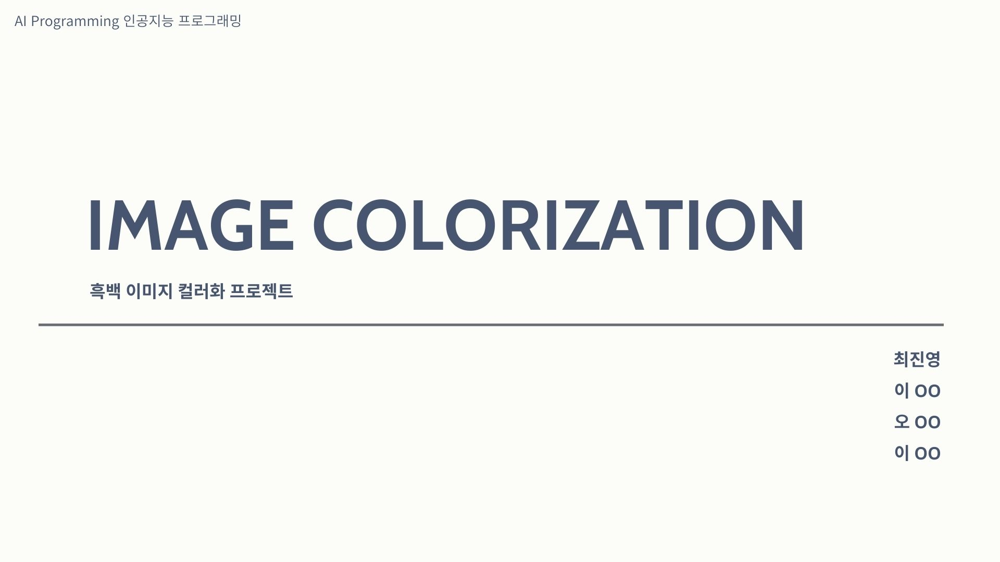
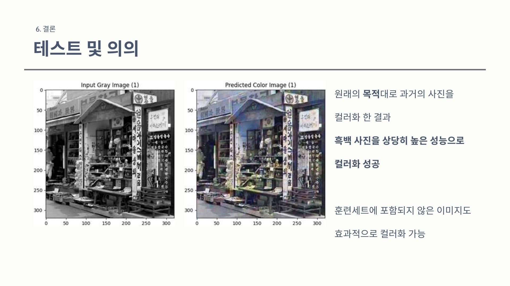

# 🪄 ImageColorization
## 🦖 Presentation

## ✒️ Report
If you are interested in report of Image Colorization project, this is the link here!
📌 ImageColorization.pdf[📝](https://github.com/choiwlsd/ImageColorization/blob/main/assets/ImageColorization.pdf)
